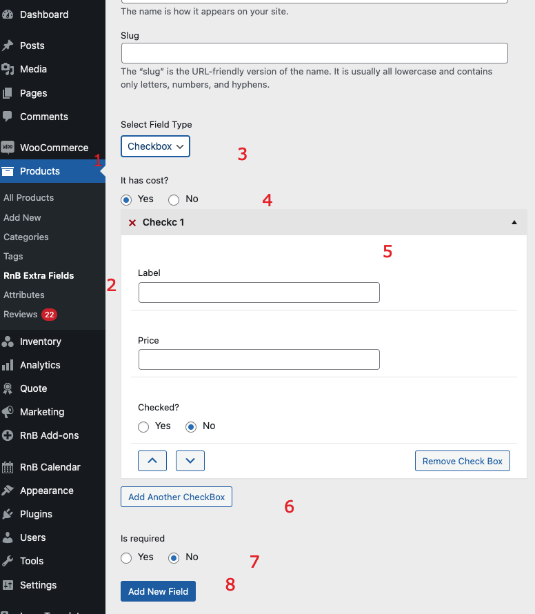

#Checkbox Field

### After activating the plugin, Add Checkbox Field,  Please follow below screenshot

1. `Go to product form admin panel`
2. `Select extra field `
3. `It has cost? or free`
4. `If has custom name`
5. `Add color field`
- Select color`
- Label
- Plugins
- Price
- Default
7. `Add placeholder`
8. `Make this field required or not `
9. `Sold individual or not `
10.` Press Add New button to add data `
