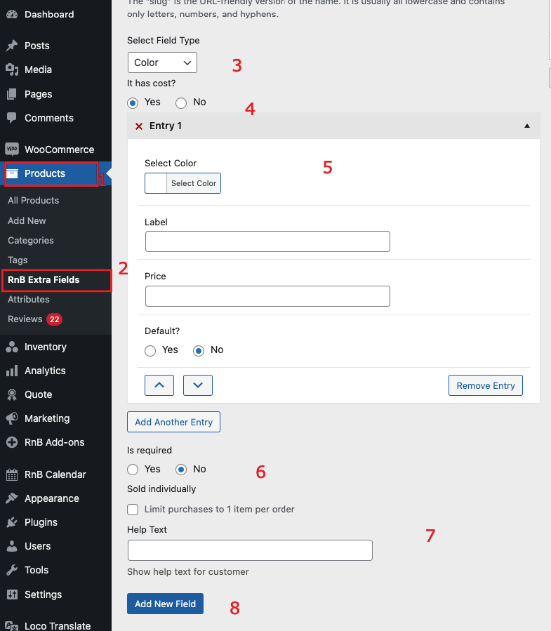

#Color Field

### After activating the plugin, Add Color Field,  Please follow below screenshot

1. `Go To Product Taxonomy`
2. `Select Extra Field `
3. `It has cost? or free`
4. `If has custom name`
5. `Add Color Field`
- Select Color
- Label
- Plugins
- Price
- Default
6. `Is required`
7. `Help text to display on frontend`
8. `Sold Individual or not `
9. `Press Add New field to add data` 
