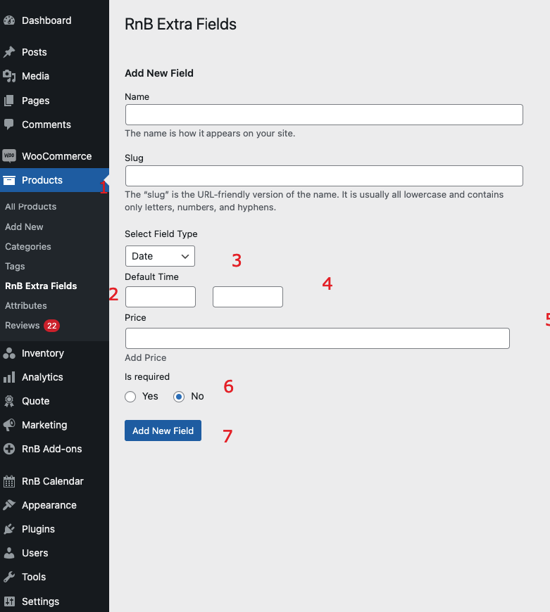

#Date Field

1. `Go To Product Taxonomy`
2. `Select Extra Field` 
3. `Select Field Type Date`
4. `Add field default value (optional)`
5. `Add Price (optional )`
6. `Add Placeholder`
7. `Make this field required or not `
8. `Sold Individual or not `
9. `Press Add New field to add data `