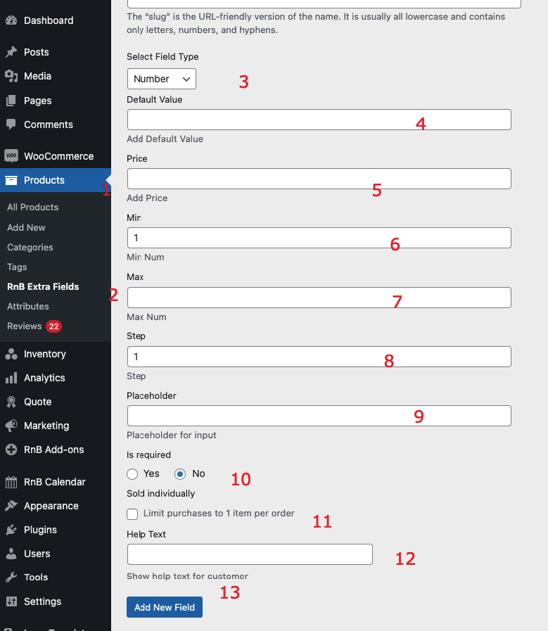

#Number Field

### After activating the plugin, Add Number Field,  Please follow below screenshot

1. `Go To Product Taxonomy`
2. `Select Extra Field `
3. `Select Field Type Number`
4. `Add field default value (optional)`
5. `Add Price (optional )`
6. `Set Min value`
7. `Set Max value`
8. `Set step`
9. `Add Placeholder`
10. `Make this field required or not `
11. `Sold Individual or not `
12. `Press Add New field to add data `
