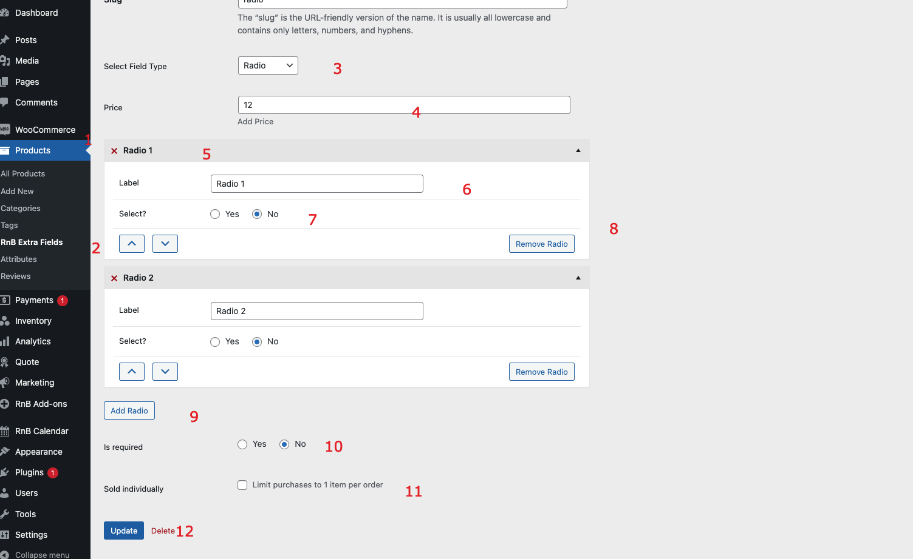

#Multi Select Field

### After activating the plugin, add select field,  Please follow below screenshot

1. `Go to product from admin panel`
2. `Select extra field `
3. `Select field type to Radio`
4. `Add price (Optional)`
5. `Add radio options`
6. `Add label`
7. `Default select (Optional)`
8. `Remove option `
9. `Add more option`
10. `Is required (Optional)`
10. `Sold Individual or not `
11.` Press add new/update button to add data `
