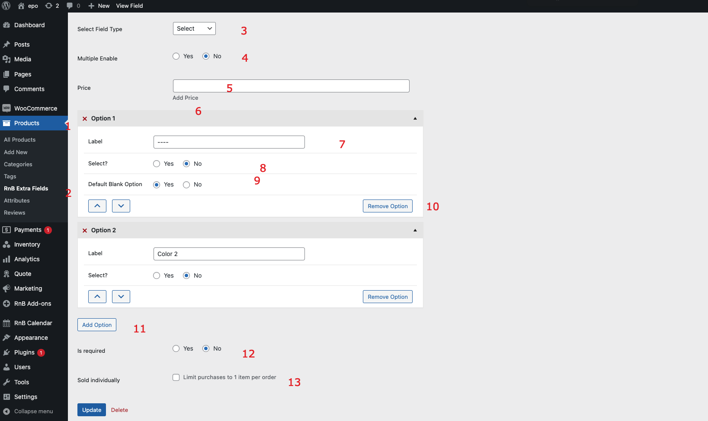

#Select Field

### After activating the plugin, Add Select Field,  Please follow below screenshot

1. `Go to product from admin panel`
2. `Select extra field `
3. `Select field type to select`
4. `Select select type multiple enable no`
5. `Add price (Optional)`
6. `Add select options`
7. `Add Label`
8. `Default select (Optional)`
9 `Make first select as Blank `
10. `Remove option `
11. `Remove`
12. `Add More option`
13. `Sold Individual or not `
14.` Press add new/update Button to add data `
