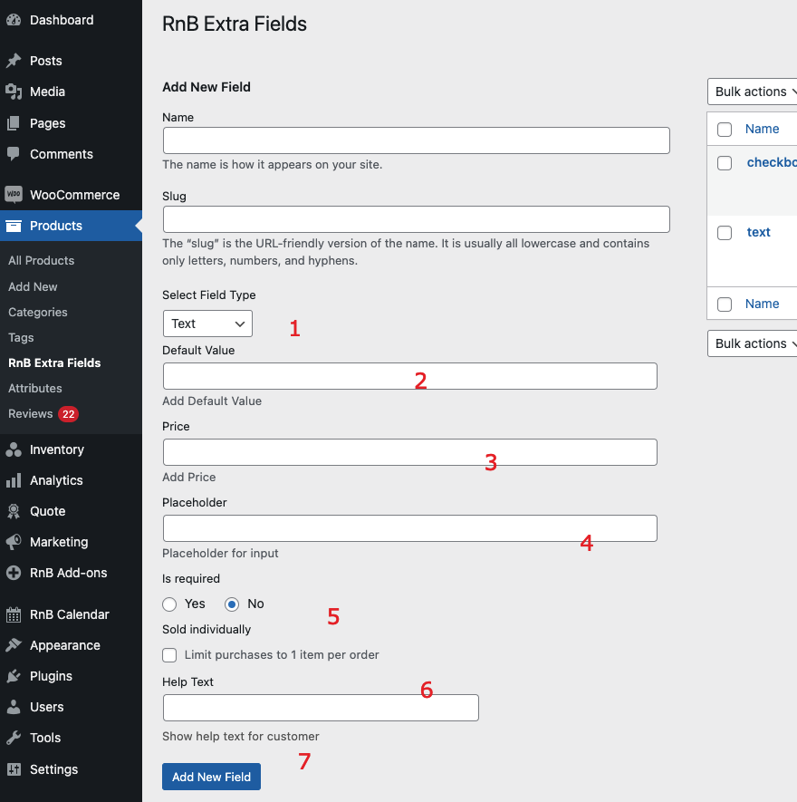

#Text Field

### After activating the plugin, Add Text Field,  Please follow below screenshot

1. `Go To Product Taxonomy`
2. `Select Extra Field`
3. `Select Field Type as Text`
4. `Add default value (optional)`
5. `Add Price (optional)`
6. `Add Placeholder`
7. `Make this field required or not` 
8. `Sold Individual or not `
9. `Press Add New field to add data `
