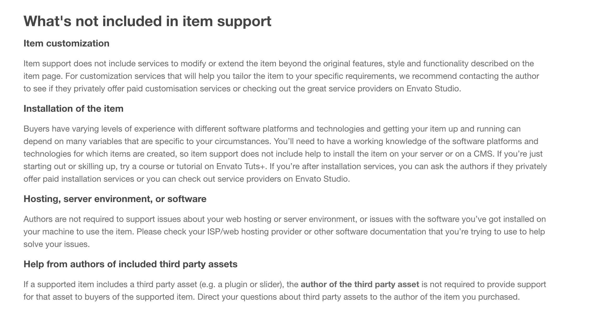

# Support

Please create a support ticket on `Ticksy` if you faced any issues.

https://redqsupport.ticksy.com/

> But before open a ticket, we suggest you to check [FAQ](/faq) and [Customization](/customization) section. There is a high chance we already provide a solution on that `faq` or `customization` section.

Also, We strictly follow the Envato item support policy https://themeforest.net/page/item_support_policy
you can find what's not included in the support there

